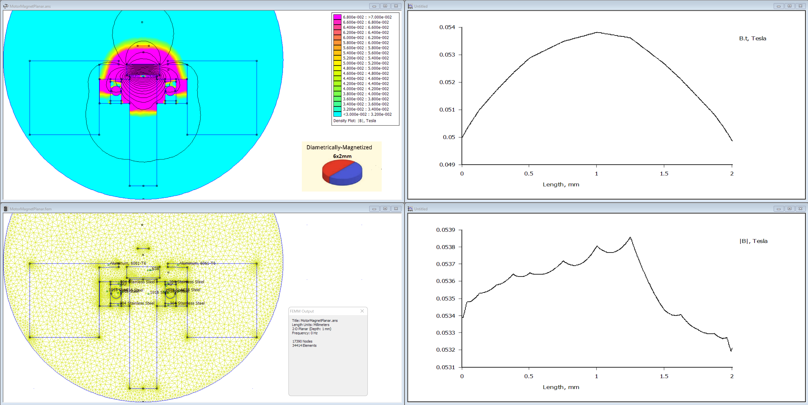

Magnetic field plots using [Femm](https://www.femm.info/) for ⌀6x2 N38 magnet on a shaft face 3mm below PCB.

Acceptable |B| and Bxy field ranges in the [datasheet](../../Datasheets/TLE5012B%20-%20dataheet.pdf).