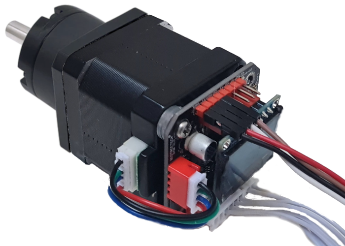

# StepperServo-hardware
Kicad PCB design

Assembly of the board and geared stepper

## Tips
- Attaching magnet with the glue - [video](https://youtu.be/mQyXR3hITy0?t=41)

## Attribution
- Initial schematics from [Intellistep](https://github.com/CAP1Sup/Intellistep/tree/master/Kicad/BTTS57Bv2) by [jlmxyz](https://github.com/jlmxyz/Intellistep/tree/RevIngSchematics/Kicad/BTTS57Bv2) and [CAP1Sup](https://github.com/CAP1Sup)
- Board inspiration by [Bigtreetech](https://www.youtube.com/watch?v=nuKLfyWq0CM)